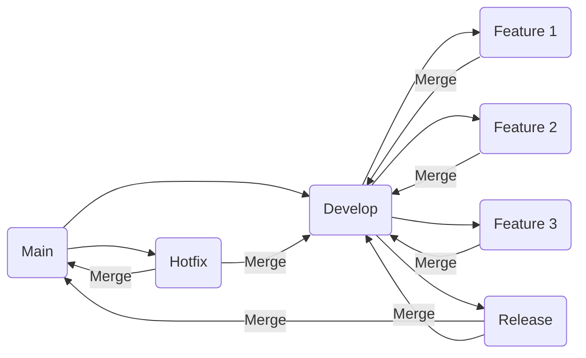

# Header 1

## Header 2

### Header 3

#### Header 4

##### Header 5

###### Header 6

A short description

```python
import sys

print('hello')
sys.exit()
```

* Exemplo 1
* Exemplo 2
* Exemplo 3

1. Exemplo 1
2. Exemplo 2
3. Exemplo 3

content in paragraph with footnote[^1] markup.

[^1]: footnote explain

**Bold**

*Italic*

~~Strike~~

[Link](#)

[PDF Preview](https://www.mackenzie.br/fileadmin/OLD/47/Graduacao/CCBS/Cursos/Ciencias_Biologicas/1o_2012/Biblioteca_TCC_Lic/2009/2o_Semestre/Karen_e_Priscila.pdf)

[Microsoft](https://en.wikipedia.org/wiki/Microsoft)

[Hello world](https://en.wikipedia.org/wiki/%22Hello,_World!%22_program)

* [ ] TODO 1
* [X] TODO 2
* [X] TODO 3

> Citation

`Inline code`

| col1 | col2 | col3 |
| ---- | ---- | ---- |
| row  | row  | row  |
| row  | row  | row  |

$$
e^{i\pi} + 1 = 0
$$

$$
e^{i\pi} + 1 = 0
$$

The HTML specification
is maintained by the W3C.

*[HTML]: Hyper Text Markup Language
*[W3C]: World Wide Web Consortium


