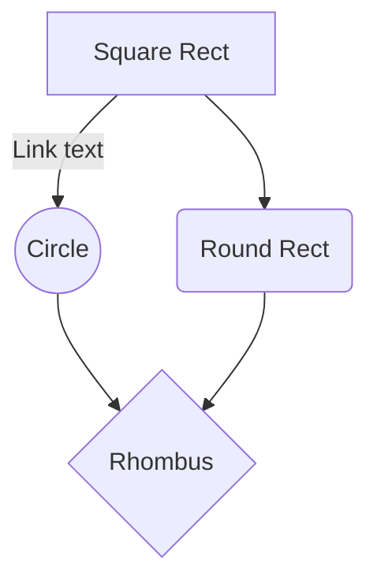

# Header 1


## Header 2

```python
import sys

print('hello')
sys.exit()
```

* Exemplo 1
* Exemplo 2
* Exemplo 3
* Exemplo 4
* Exemplo 5

**Bold**

*Italic*

$$
e^{i\pi} + 1 = 0
$$


```mermaid
graph TD
    A[Square Rect] -- Link text --> B((Circle))
    A --> C(Round Rect)
    B --> D{Rhombus}
    C --> D
```
